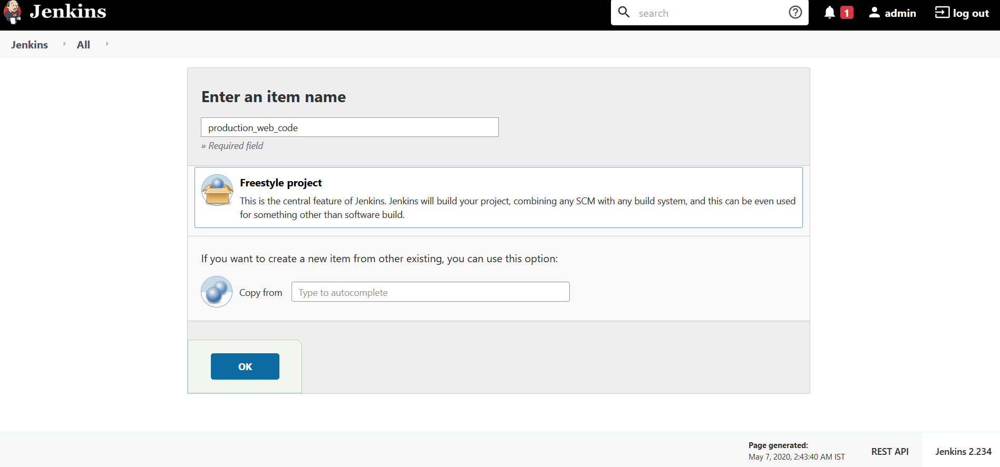
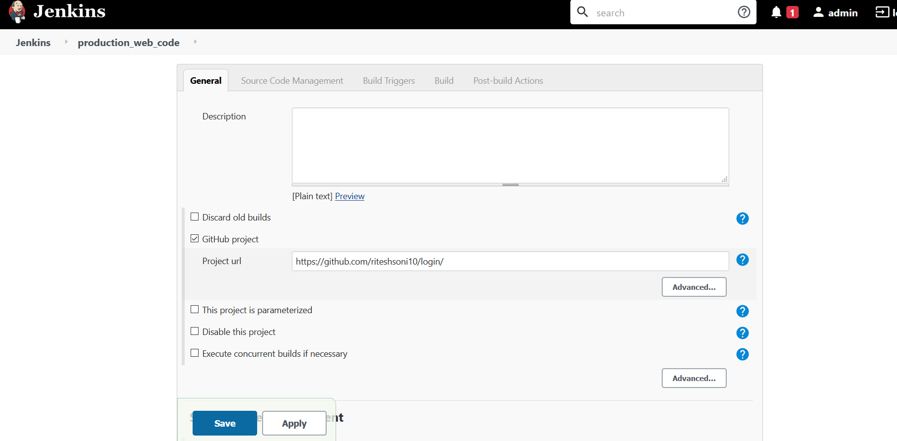
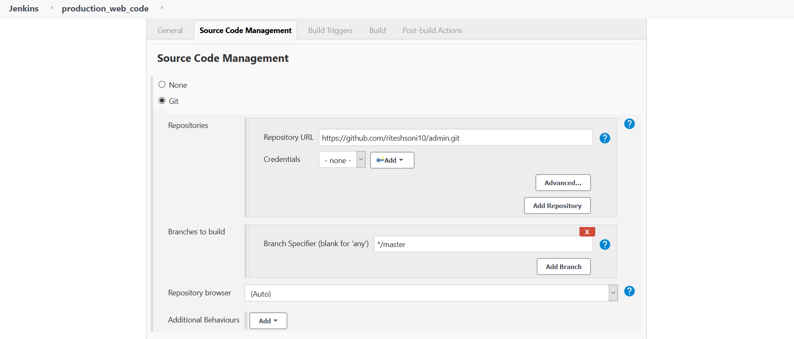
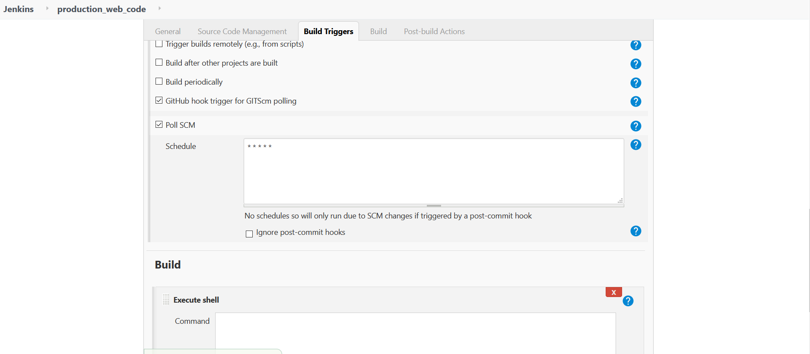
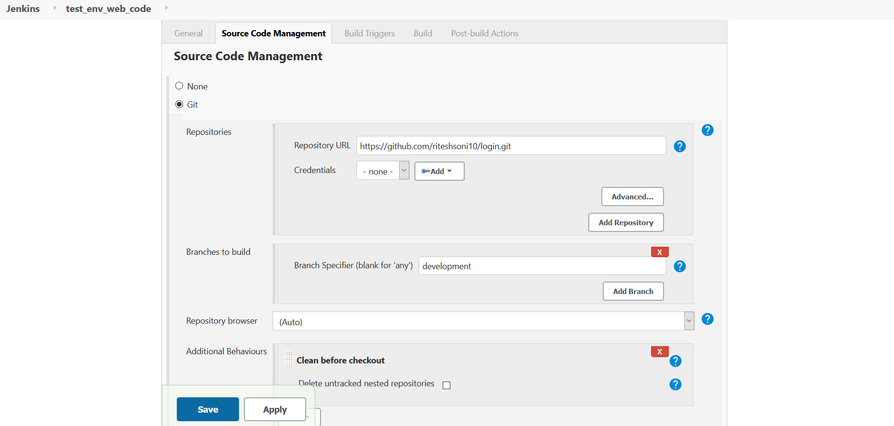
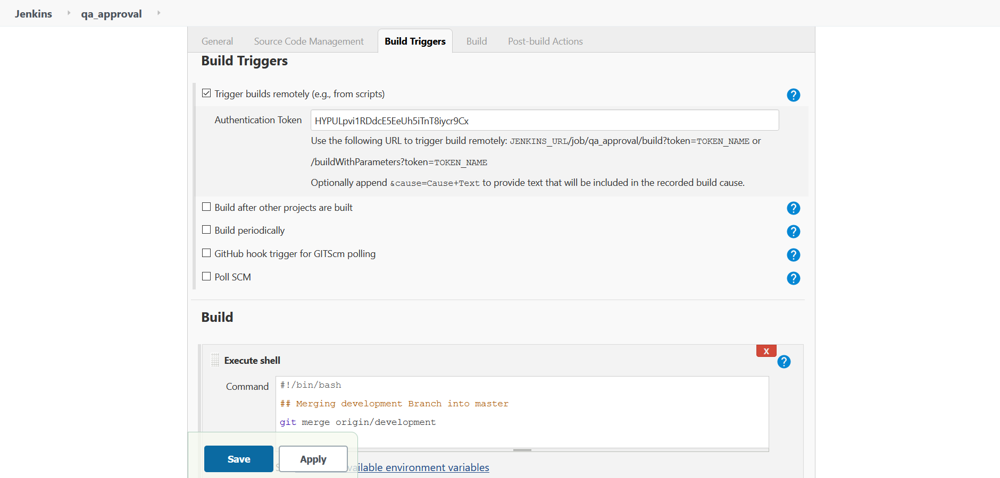
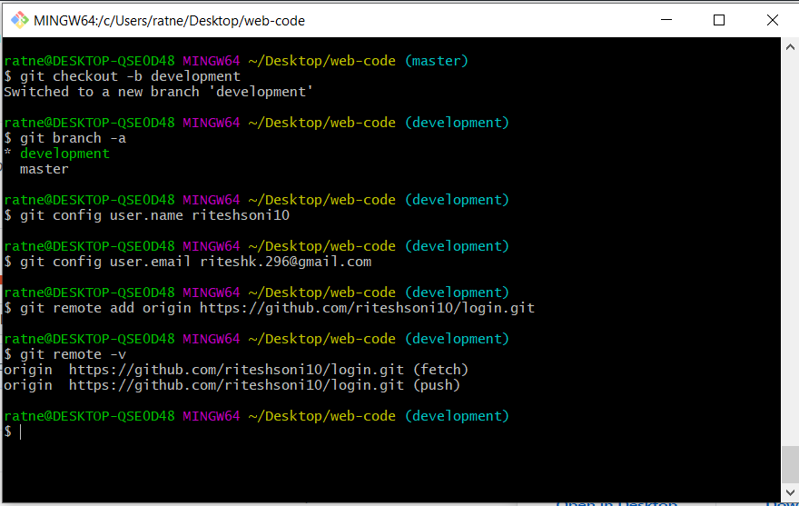
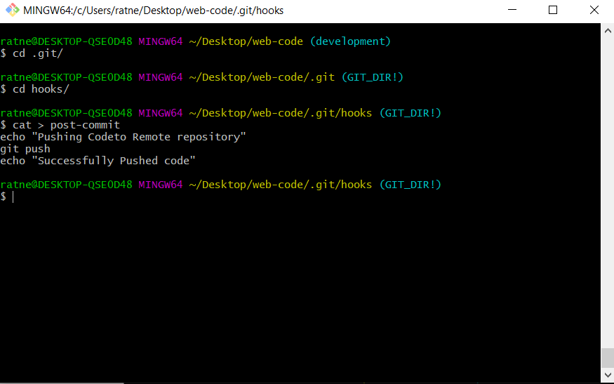

# Automated Code Deployment

Sometimes deployment can be very tidious task from cloning the code from the Git to deployment to the test and production environment  for the developers. which includes the dependency on the operations team for deployment of nay new feature. The complete process of deployment can be automated by following the instructions in the project. The objective of this project is to remove the blockheads and manual intervention in the process of deployment.

##### Sample Project


## Pre-requisites
- Docker Engine
- Jenkins
- Git


## Installation

- Clone this repository to add scripts for Jenkins Jobs

`Github Project URL`: https://github.com/riteshsoni10/login

`Github Repository`: https://github.com/riteshsoni10/login.git

Let's start with the configuration of **JENKINS Jobs** 

#### Production Environment. 

1. Login into jenkins GUI
2. Click on `New Item` in the left column

<p align="center">
  
  <br>
  <em>Fig 2.: New Job Diagram </em>
</p>

3. Enable GitHub Project
    - Click on GitHub Project 
    - Enter the Github Project URL

<p align="center">
  
  <br>
  <em>Fig 3.: GitHub URL Configuration </em>
</p> 
 
4. Configure the Source Code Management
    In source code management, the project's repository URL is to be entered. If the repository is public, there will be no need to configure the credentials; otherwise credentials for access of the repository will have to configured.

    In `branches to build` variable, the branch from which the code will be downloaded is to be configured. In our case, since this job is for production environment, the master branch is configured.

<p align="center">
  
  <br>
  <em>Fig 4.: Production Job SCM Configuration </em>
</p>


5. Build Triggers
    Build triggers notify when the job will be executed.  For now, Poll SCM variable is used, since the jenkins is in the private network and github is hosted in public network.
    
    `Poll SCM trigger` checks for any changes in the branch of the repository during the interval configured. Currently, the Poll SCM interval is configured to validate for changes in the branch at an interval of every minute.

<p align="center">
  
  <br>
  <em>Fig 5.: Production Build Trigger Configuration </em>
</p>

6. Build
    In build step, Select `Execute Bash Shell` from `Add Build Step`.
    Paste the entire content of Bash script named production_job.sh in this step.
 
 7. Apply and then Save the Job
 
 
#### Development Environment 

The similiar steps are needed to be followed as for Production Environment with some changes

1. Creat a new job with name test_env_web_code
2. In Step 4
    Change the `branches to build` variable with the `development` branch; so that development branch code can be used for testing environment deployment

<p align="center">
  
  <br>
  <em>Fig 6.: Test Environment SCM Configuration </em>
</p>

2. In Step 6
    Rplace the contents of production_job.sh script with test_environment_job.sh bash script.

3. Apply and Save
      

#### For Quality Assurance Team

The Jenkins Job Enables the QAT to merge the development branch into master branch on proper testing of development branch.

The similiar steps are needed to be followed as for `Production Environment` with some changes

1. Create a new Job named qa_approval
2. In Step 5
    Select the `Trigger builds remotely` Option, since the QAT team will trigger job remotely from any script as soon as they find the code in development branch is ready to go for production.
    
    In `Authentication Token`, a random token is used for authentication. The same token is needed to be passed along with the remote URL like
    ```
    Authentication Token=HYPULpvi1RDdcE5EeUh5iTnT8iycr9Cx
    JENKINS_URL=192.168.10.140 
    
    > 192.168.10.140 is Jenkins Server IP
    
   http://JENKINS_URL/job/qa_approval/build?token=HYPULpvi1RDdcE5EeUh5iTnT8iycr9Cx
    
    ```

<p align="center">
  
  <br>
  <em>Fig 7.: QAT Build Trigger Configuration </em>
</p>

3. In Step 6.
    Replace the contents of script with following code
    
    ```
    #!/bin/bash
    git merge origin/development
    ```
    
4. Apply and Save

### Development Team

1. Create new code directory
    ```
    mkdir /web-code
    ```
2. Initial configuration
 
   Initialise the git
    ```
    cd /web-code
    git init
    ```
   
   Configure username and email id
   ```
   git config user.name test123
   git config user.email test1234@gmail.com
   ```
   
   Add remote repository to keep track of code with the remote repository
   ```
   git remote add https://github.com/riteshsoni10/login.git
   ```

<p align="center">
  
  <br>
  <em>Fig 8.: Developer Initial  GitHub Configuration </em>
</p>

3. Configure the post-Commit Hooks
    Configuration of  post commit hooks to automate the code push to remote repository
    
    ```sh
    cd /web-code
    cd .git/hooks
    ```
    
    Add the below lines in file named `post-commit` inside the `hooks` directory
    ```
    #!/bin/bash
    echo "Pushing Code to Remote repository"
    git push
    echo "Successfully Pushed code"
   ```
   
<p align="center">
  
  <br>
  <em>Fig 9.: GitHub Post-Commit Configuration </em>
</p>

4. Create a branch from master branch i.e development branch
    The development branch is used for testing new features i.e for test Environment. The new changes are pushed into this branch. After proper approval by the QAT that the code is ready to go for production. The QAT team remotely builds the *job* `qa_approval`, to merge the development branch with master branch
    
    ```
    git checkout -b development
    ```
    

    
