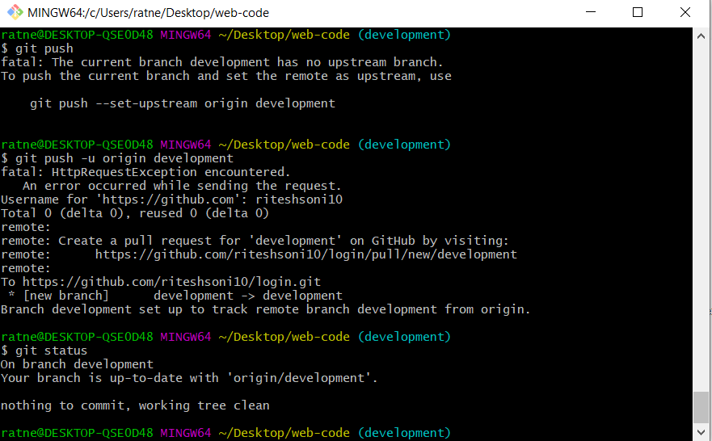
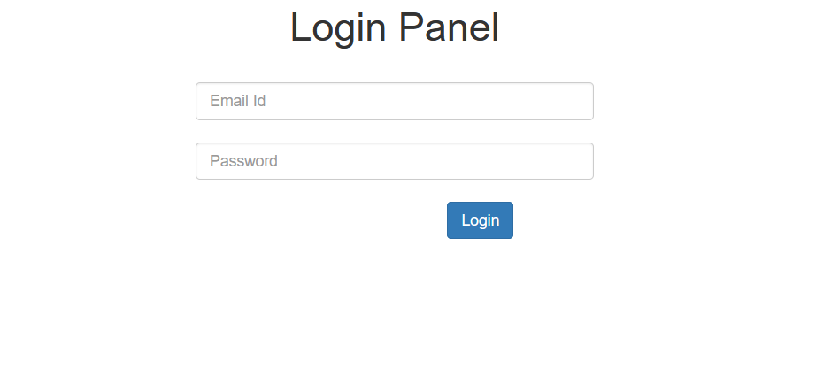
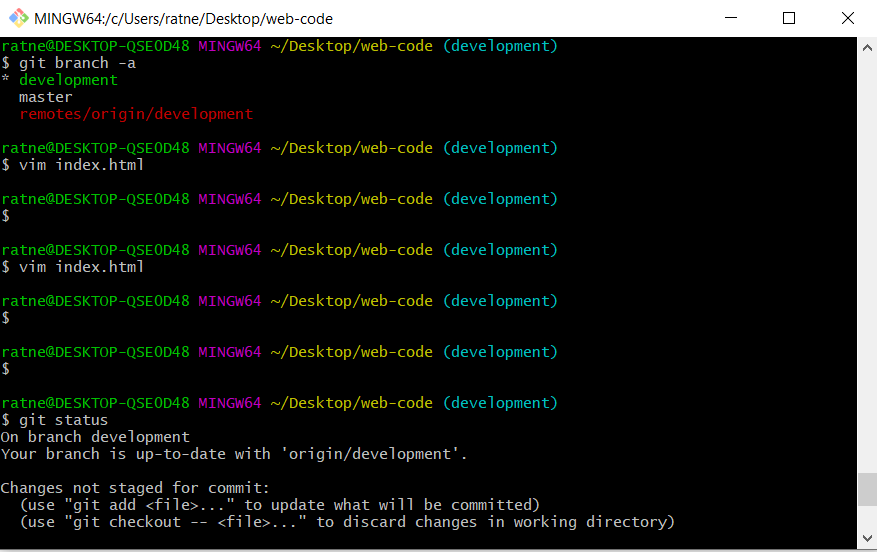
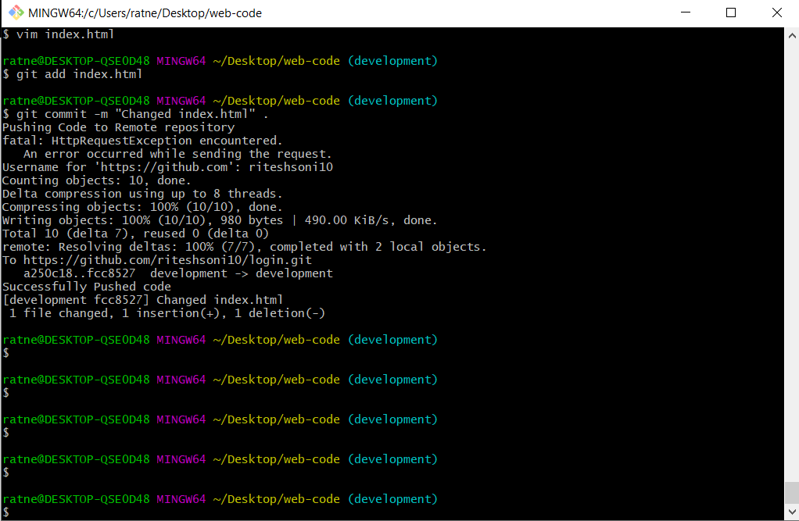
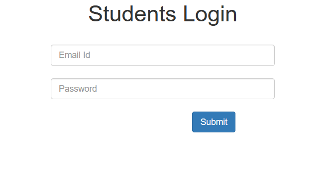

# Automated Code Deployment

Sometimes deployment can be very tidious task from cloning the code from the Git to deployment to the test and production environment  for the developers. which includes the dependency on the operations team for deployment of nay new feature. The complete process of deployment can be automated by following the instructions in the project. The objective of this project is to remove the blockheads and manual intervention in the process of deployment.

##### Sample Project

<p align="center">
  
  <br>
  <em>Fig 1.: Process Flow Diagram </em>
</p>


## Pre-requisites
- Docker Engine
- Jenkins
- Git


## Installation

- Clone this repository to add scripts for Jenkins Jobs

`Github Project URL`: https://github.com/riteshsoni10/login

`Github Repository`: https://github.com/riteshsoni10/login.git

Let's start with the configuration of **JENKINS Jobs** 

#### Production Environment. 

1. Login into jenkins GUI
2. Click on `New Item` in the left column

<p align="center">
  
  <br>
  <em>Fig 2.: New Job Diagram </em>
</p>

3. Enable GitHub Project
    - Click on GitHub Project 
    - Enter the Github Project URL

<p align="center">
  
  <br>
  <em>Fig 3.: GitHub URL Configuration </em>
</p> 
 
4. Configure the Source Code Management
    In source code management, the project's repository URL is to be entered. If the repository is public, there will be no need to configure the credentials; otherwise credentials for access of the repository will have to configured.

    In `branches to build` variable, the branch from which the code will be downloaded is to be configured. In our case, since this job is for production environment, the master branch is configured.

<p align="center">
  
  <br>
  <em>Fig 4.: Production Job SCM Configuration </em>
</p>


5. Build Triggers
    Build triggers notify when the job will be executed.  For now, Poll SCM variable is used, since the jenkins is in the private network and github is hosted in public network.
    
    `Poll SCM trigger` checks for any changes in the branch of the repository during the interval configured. Currently, the Poll SCM interval is configured to validate for changes in the branch at an interval of every minute.

<p align="center">
  
  <br>
  <em>Fig 5.: Production Build Trigger Configuration </em>
</p>

6. Build
    In build step, Select `Execute Bash Shell` from `Add Build Step`.
    Paste the entire content of Bash script named production_job.sh in this step.
 
 7. Apply and then Save the Job
 
 
#### Development Environment 

The similiar steps are needed to be followed as for Production Environment with some changes

1. Creat a new job with name test_env_web_code
2. In Step 4
    Change the `branches to build` variable with the `development` branch; so that development branch code can be used for testing environment deployment

<p align="center">
  
  <br>
  <em>Fig 6.: Test Environment SCM Configuration </em>
</p>

2. In Step 6
    Rplace the contents of production_job.sh script with test_environment_job.sh bash script.

3. Apply and Save
      

#### For Quality Assurance Testing Team

The Jenkins Job Enables the QAT to merge the development branch into master branch on proper testing of development branch.

The similiar steps are needed to be followed as for `Production Environment` with some changes

1. Create a new Job named qa_approval
2. In Step 5
    Select the `Trigger builds remotely` Option, since the QAT team will trigger job remotely from any script as soon as they find the code in development branch is ready to go for production.
    
    In `Authentication Token`, a random token is used for authentication. The same token is needed to be passed along with the remote URL like
    ```
    Authentication Token=HYPULpvi1RDdcE5EeUh5iTnT8iycr9Cx
    JENKINS_URL=192.168.10.140 
    
    > 192.168.10.140 is Jenkins Server IP
    
   http://JENKINS_URL/job/qa_approval/build?token=HYPULpvi1RDdcE5EeUh5iTnT8iycr9Cx
    
    ```

<p align="center">
  
  <br>
  <em>Fig 7.: QAT Build Trigger Configuration </em>
</p>

3. In Step 6.
    Replace the contents of script with following code
    
    ``` 
    #!/bin/bash
    ##Merging development Branch into master
    git merge origin/development

    ## Pushing code to master
    git push origin HEAD:master

    ```
    
4. Apply and Save

### Development Team

1. Create new code directory
    ```
    mkdir /web-code
    ```
2. Initial configuration
 
   Initialise the git
    ```
    cd /web-code
    git init
    ```
   
   Configure username and email id
   ```
   git config user.name test123
   git config user.email test1234@gmail.com
   ```
   
   Add remote repository to keep track of code with the remote repository
   ```
   git remote add https://github.com/riteshsoni10/login.git
   ```

<p align="center">
  
  <br>
  <em>Fig 8.: Developer Initial  GitHub Configuration </em>
</p>

3. Configure the post-Commit Hooks
    Configuration of  `post commit hooks` to automate the code push to remote repository
    
    ```sh
    cd /web-code
    cd .git/hooks
    ```
    
    Add the below lines in file named `post-commit` inside the `hooks` directory
    ```
    #!/bin/bash
    echo "Pushing Code to Remote repository"
    git push
    echo "Successfully Pushed code"
   ```
   
<p align="center">
  
  <br>
  <em>Fig 9.: GitHub Post-Commit Configuration </em>
</p>

4. Create a branch from master branch i.e development branch

  The development branch is used for testing new features i.e for test Environment. The new changes are pushed into this branch. After proper approval by the QAT that the code is ready to go for production. The QAT team remotely builds the *job* `qa_approval`, to merge the development branch with master branch
    
    ```
    git checkout -b development
    ```
<p align="center">
  
  <br>
  <em>Fig 10.: Development Branch Initial Push </em>
</p>

5. Current Live Production Environment

  The **production** is currently live with the `master branch` code. The production can be accessed from the public URL, that will be displayed on the successfful Production Jenkins JOB run i.e `production_web_code`. 
  
  The `public URL` for the *production* can be found at **console output** of the production Jenkins JOB. The tunneling is created using `ngrok server`.
  
<p align="center">
  
  <br>
  <em>Fig 11.: Production Environment  </em>
</p>

6. New Feature Request in Production Environment

  Suppose, A new feature request arrived from Client, that from the customer point of view, headline `Login Portal` is not looking appropriate now. A change request was raised to change the headline of the form to `Students Login` and `login` button to `submit` button. The developers start working into the code by pull master branch code in development. They have successfully changed the code in their local.
  
<p align="center">
  
  <br>
  <em>Fig 12.: Feature Change in Development Branch </em>
</p>

7. Commit the change in development

  As soon as developer commits the change in `development branch`, the autmated push in development branch is triggered by `post-commit hook`. 

<p align="center">
  
  <br>
  <em>Fig 13.: Staging and Commit and Automated Push Feature Change in Development Branch </em>
</p>

8. After New changes in Development Branch

  As soon as new change is detected in development branch, the *Jenkins job* `test_env_web_code` is *triggered* and the new code is deployed in Test Environment.

<p align="center">
  
  <br>
  <em>Fig 14.: Development Branch Front-End </em>
</p>


### Quality Assurance Testing Team

QAT Team has been provided with the Test Environment IP i.e 192.168.143.140:8085 to test new changes in the Test Environment. If they are satisfied with the new changes ie. no bugs are found, they trigger the **remote Build URL** for the `qa_approval` Jenkins JOB which merges the deevelopment branch with master branch.

```
Remote Build URL:
http://192.168.0.104:8080/job/qa_approval/build?token=HYPULpvi1RDdcE5EeUh5iTnT8iycr9Cx
```

When the development branch is merged with the master branch, the JENKINS JOB `production_web_code` will be triggered in the next `POLL SCM interval`, which deploys the development branch code in Production Branch.

Production Branch gets updated and will look like as shown below.

<p align="center">
  
  <br>
  <em>Fig 15.:Production Environment after merge </em>
</p>
    

> Source: [LinuxWorld Informatics Pvt. Ltd](http://www.linuxworldindia.org/)
>
> Under guidance of: [Mr. Vimal Daga](https://in.linkedin.com/in/vimaldaga)
>
> Written By: [Ritesh Kumar](https://www.linkedin.com/in/riteshsoni10)
>
> DevOps Assemply Lines Task 
